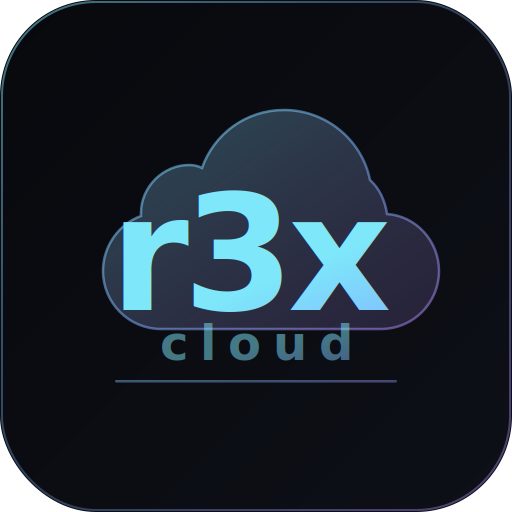

<p align="center">
  
</p>

<h1 align="center">r3x-cloud</h1>

<p align="center">
  <strong>Interactive Cloud Resource Explorer</strong><br>
  Scan your cloud accounts, detect unused resources, and stop paying for things you forgot about.
</p>

<p align="center">
  <a href="#download"></a>
  <a href="LICENSE"></a>
  
</p>

---

## What is r3x-cloud?

r3x-cloud is a **desktop application** that connects to your cloud accounts, scans every resource, and tells you exactly what's wasting money. It runs entirely on your machine — **read-only, no data leaves your laptop**.

Built with Rust and SolidJS for speed. No browser tabs, no SaaS subscriptions, no agents running in your cloud.

### The problem

Cloud bills grow silently. Engineers spin up VMs for testing and forget them. Snapshots accumulate. Static IPs sit unused. Load balancers point to nothing. Nobody notices until the monthly bill arrives.

### The solution

Run a scan. See everything. Get actionable recommendations with estimated savings. Copy the cleanup commands. Done.

---

## Features

### 25 Resource Types (GCP)

| Category | Resources |
|----------|-----------|
| **Compute** | VMs, Machine Images, App Engine Versions |
| **Storage** | Persistent Disks, Snapshots, Cloud Storage Buckets |
| **Databases** | Cloud SQL, Spanner, Memorystore (Redis), BigQuery Datasets |
| **Networking** | Networks, Firewall Rules, Load Balancers, Static IPs, NAT Gateways, VPN Tunnels |
| **Containers** | GKE Clusters, Cloud Run Services, Artifact Registry |
| **Serverless** | Cloud Functions |
| **Data & Analytics** | Dataproc Clusters, Pub/Sub Topics & Subscriptions |
| **Security & Ops** | Secret Manager, Log Sinks |

### 26 Detection Rules

Automatically flag resources that are costing you money for no reason:

| Rule | Severity | What it catches |
|------|----------|-----------------|
| Stopped VMs | High | Compute instances in TERMINATED state |
| Unattached Disks | High | Persistent disks not attached to anything |
| Large Unattached Disks | Critical | Unattached disks > 100GB |
| Old Snapshots | Medium | Disk snapshots older than 90 days |
| Unused Static IPs | High | Static IPs in RESERVED state |
| Empty Load Balancers | Medium | Forwarding rules with no backend |
| Disabled Firewall Rules | Low | Firewall rules that are disabled |
| Old Machine Images | Low | Custom images older than 180 days |
| Stopped Cloud SQL | High | SQL instances in STOPPED/SUSPENDED state |
| Idle Cloud Functions | Medium | Functions with min instances > 0 |
| Idle Cloud Run | Medium | Cloud Run with min instances > 0 |
| Degraded GKE Clusters | Critical | GKE clusters in ERROR/DEGRADED state |
| Overprovisioned GKE | High | GKE clusters with 10+ nodes |
| Empty BigQuery Datasets | Low | Datasets with no tables |
| Large BigQuery Datasets | Medium | Datasets over 100GB |
| Detached Pub/Sub Subs | High | Subscriptions whose topic was deleted |
| Idle Spanner Instances | High | Spanner instances (very expensive) |
| Idle Memorystore | Medium | Redis instances that may be unused |
| Stopped App Engine | Low | Versions stopped but still deployed |
| NAT Gateways | Low | Cloud NAT incurring hourly costs |
| VPN Tunnels Down | High | Tunnels not in ESTABLISHED state |
| Large Artifact Registry | Medium | Repos over 10GB storage |
| Idle Dataproc Clusters | High | Running clusters that may be idle |
| Disabled Secrets | Low | Secrets with all versions disabled |
| Disabled Log Sinks | Low | Log sinks that are disabled |
| Untagged Resources | Medium | Resources missing labels |

### Interactive Dashboard

- **Savings summary** — total estimated monthly savings at a glance
- **Health score** — donut chart showing resource health
- **Cost trend** — SVG area chart tracking costs across scans
- **Resource breakdown** — bar chart by type with counts

### Keyboard-Driven UI

| Key | Action |
|-----|--------|
| `:` | Command palette |
| `/` | Search resources |
| `j` / `k` | Navigate table rows |
| `Enter` | Open resource detail |
| `r` | Refresh / rescan |
| `t` | Toggle dark/light theme |
| `d` | Jump to dashboard |
| `s` | Jump to scan |
| `f` | Jump to findings |
| `Esc` | Close panels |

### More

- **Scan Diff** — compare two scans side-by-side, see what changed
- **Infra Map** — visual topology of your cloud resources
- **Scan History** — track all previous scans with timestamps
- **Export** — CSV and JSON export for resources and findings
- **Dark & Light themes** — toggle with `t`
- **Configurable rules** — enable/disable rules, adjust thresholds
- **Multi-account** — manage multiple GCP projects

---

## Privacy & Security

| | |
|-|-|
| **Read-only** | r3x-cloud never modifies your cloud resources. It generates CLI commands you can review and run yourself. |
| **Local-only** | All data stays on your machine in a local SQLite database. No telemetry, no analytics, no cloud sync. |
| **No credentials stored** | Uses your existing `gcloud` CLI authentication. No API keys to configure. |
| **Open source** | Full source code available. Audit it yourself. |

---

## Download

Download the latest release for your platform:

| Platform | Architecture | Format |
|----------|-------------|--------|
| **macOS** | Apple Silicon (M1/M2/M3/M4) | `.dmg` |
| **macOS** | Intel | `.dmg` |
| **Windows** | x86_64 | `.msi` |
| **Linux** | x86_64 | `.deb` / `.AppImage` |

> [**Download Latest Release**](../../releases/latest)

---

## Prerequisites

Before using r3x-cloud, you need:

1. **Google Cloud SDK** (`gcloud` CLI) installed
2. **Authenticated** with `gcloud auth login`
3. **A GCP project** you want to scan

```bash
# Install gcloud (macOS)
brew install google-cloud-sdk

# Authenticate
gcloud auth login

# Set your project
gcloud config set project YOUR_PROJECT_ID
```

### Required GCP Permissions

r3x-cloud uses **read-only** API access. The recommended role is `roles/viewer` on the project. For specific APIs:

| API | Permission | Used for |
|-----|-----------|----------|
| Compute Engine | `compute.instances.list` | VMs, disks, snapshots, IPs, firewalls, images, networks, NAT, VPN |
| Cloud Storage | `storage.buckets.list` | Storage buckets |
| Cloud SQL | `cloudsql.instances.list` | SQL instances |
| Cloud Functions | `cloudfunctions.functions.list` | Serverless functions |
| Cloud Run | `run.services.list` | Cloud Run services |
| GKE | `container.clusters.list` | Kubernetes clusters |
| BigQuery | `bigquery.datasets.list` | BigQuery datasets |
| Pub/Sub | `pubsub.topics.list` | Pub/Sub topics & subscriptions |
| Spanner | `spanner.instances.list` | Spanner instances |
| Memorystore | `redis.instances.list` | Redis instances |
| App Engine | `appengine.versions.list` | App Engine versions |
| Dataproc | `dataproc.clusters.list` | Dataproc clusters |
| Secret Manager | `secretmanager.secrets.list` | Secrets |
| Logging | `logging.sinks.list` | Log sinks |
| Artifact Registry | `artifactregistry.repositories.list` | Container/package repos |

---

## Building from Source

### Requirements

- [Node.js](https://nodejs.org/) 22+
- [Rust](https://rustup.rs/) (stable)
- [Tauri CLI](https://v2.tauri.app/start/prerequisites/)

**Linux only:**
```bash
sudo apt-get install libwebkit2gtk-4.1-dev libappindicator3-dev librsvg2-dev patchelf
```

### Build

```bash
# Clone the repo
git clone https://github.com/rebash-rebash/r3x-cloud.git
cd r3x-cloud

# Install frontend dependencies
npm install

# Run in development mode
npm run tauri dev

# Build for production
npm run tauri build
```

The built application will be in `src-tauri/target/release/bundle/`.

---

## Architecture

```
┌─────────────────────────────────────────────────┐
│               Native Window (Tauri 2)           │
│                                                 │
│  ┌──────────────┐  IPC (invoke)  ┌───────────┐  │
│  │   SolidJS    │ ◄════════════► │   Rust    │  │
│  │   Frontend   │    events      │  Backend  │  │
│  │   (Vite+TS)  │                │           │  │
│  └──────────────┘                └─────┬─────┘  │
│                                       │         │
│                              ┌────────┴───────┐ │
│                              │   GCP REST     │ │
│                              │   APIs         │ │
│                              └────────┬───────┘ │
│                              ┌────────┴───────┐ │
│                              │ SQLite │ gcloud │ │
│                              │ Cache  │  CLI   │ │
│                              └────────────────┘ │
└─────────────────────────────────────────────────┘
```

### Tech Stack

| Layer | Technology |
|-------|-----------|
| **Desktop framework** | Tauri 2.x |
| **Frontend** | SolidJS + TypeScript + Vite |
| **Backend** | Rust (tokio async runtime) |
| **Database** | SQLite (rusqlite, bundled) |
| **HTTP client** | reqwest with rustls-tls |
| **Authentication** | gcloud CLI (`auth print-access-token`) |
| **Charts** | Custom SVG (no chart library) |
| **Rate limiting** | governor crate |

### Project Structure

```
r3x-cloud/
├── src/                          # Frontend
│   ├── components/               # 16 SolidJS components
│   │   ├── Dashboard.tsx         # Main dashboard with charts
│   │   ├── ResourceExplorer.tsx  # Filterable resource table
│   │   ├── ResourceDetail.tsx    # Resource detail panel
│   │   ├── RecommendationsPanel.tsx
│   │   ├── ScanPanel.tsx         # Scan progress UI
│   │   ├── CostTrend.tsx         # SVG area chart
│   │   ├── InfraMap.tsx          # Infrastructure topology
│   │   ├── ScanDiff.tsx          # Scan comparison
│   │   └── ...
│   ├── stores/                   # Reactive state (signals)
│   ├── lib/                      # IPC, types, formatters
│   └── styles/global.css         # Theme system
├── src-tauri/                    # Backend
│   └── src/
│       ├── cloud/gcp/            # 24 GCP scanner modules
│       ├── analysis/             # Detection rules engine
│       ├── scanner/              # Parallel scan orchestrator
│       ├── storage/              # SQLite persistence
│       ├── cost/                 # Cost estimation
│       └── export/               # CSV/JSON export
└── .github/workflows/            # CI/CD
```

---

## Roadmap

- [x] GCP: Full coverage (25 resource types)
- [x] Detection engine (26 rules)
- [x] Cost estimation
- [x] Interactive dashboard with charts
- [x] Keyboard-driven navigation
- [x] Export (CSV/JSON)
- [x] Scan history & diff
- [x] Infrastructure map
- [x] Multi-platform CI/CD
- [ ] AWS support (EC2, EBS, S3, Lambda, ELB, EIP, SG, AMI)
- [ ] Azure support (VMs, Disks, IPs, LBs, NSGs, Functions, Storage)
- [ ] Scheduled scans
- [ ] Tag-based cost allocation grouping
- [ ] Resource relationship mapping
- [ ] Safe cleanup execution (dry-run + confirmation)

---

## Contributing

Contributions are welcome. Open an issue or submit a PR.

```bash
# Development
npm run tauri dev

# Run frontend only
npm run dev

# Check Rust code
cd src-tauri && cargo check
```

---

## License

[MIT](LICENSE) - Built by [rebash](https://github.com/rebash-rebash)
